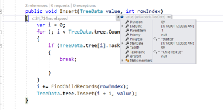
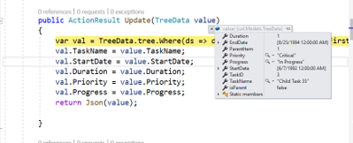
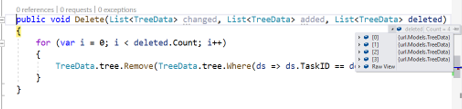
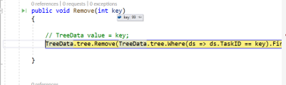

# Persisting data in server in ##Platform_Name## Treegrid control

Edited data can be persisted in the database using the RESTful web services.

All the CRUD operations in the treegrid are done through [`DataManager`](../../data). The `DataManager` has an option to bind all the CRUD related data in server-side.

> For your information, the ODataAdaptor persists data in the server as per OData protocol.

In the following section, we have explained how to perform CRUD operation in server-side using the [`UrlAdaptor`](../../data/adaptors.html#url-adaptor) and `RemoteSave Adaptor`.

## URL adaptor

You can use the [`UrlAdaptor`](../../data/adaptors.html#url-adaptor) of `DataManager` when binding data source from remote data.
In the initial load of treegrid, data are fetched from remote data and bound to the treegrid using `url` property of `DataManager`.
You can map The CRUD operation in treegrid can be mapped to server-side Controller actions using the properties `insertUrl`, `removeUrl`, `updateUrl` and `batchUrl`.

The following code example describes the above behavior.



```ts
import { TreeGrid, Edit, Toolbar } from '@syncfusion/ej2-treegrid';
import { DataManager, UrlAdaptor } from '@syncfusion/ej2-data';

TreeGrid.Inject(Edit, Toolbar);

let data: DataManager = new DataManager({
    url: "Home/DataSource",
    updateUrl: "Home/Update",
    insertUrl: "Home/Insert",
    removeUrl: "Home/Delete",
    batchUrl: "Home/Remove",
    adaptor: new UrlAdaptor
});

let treeGridObj: TreeGrid = new TreeGrid({
    dataSource: data,
    idMapping: 'TaskID',
    parentIdMapping: 'parentItem',
    hasChildMapping: 'isParent',
    toolbar: ['Add', 'Edit', 'Delete', 'Update', 'Cancel'],
    editSettings: { allowEditing: true, allowAdding: true, allowDeleting: true, mode: 'Row', newRowPosition: 'Below' },
    treeColumnIndex: 1,
    columns: [
        { field: 'TaskID', headerText: 'Task ID', isPrimaryKey: true, width: 90, textAlign: 'Right'},
        { field: 'TaskName', headerText: 'Task Name', width: 180 },
        {
            field: 'StartDate', headerText: 'Start Date', width: 90, textAlign: 'Right', editType: 'datepickeredit', type: 'date', format: 'yMd'
        },
        { field: 'Priority', headerText: 'Priority', width: 80, validationRules: { required: true } }
    ],
    height: 270
});

treeGridObj.appendTo('#TreeGrid');
```



```js
ej.treegrid.TreeGrid.Inject(ej.treegrid.Edit, ej.treegrid.Toolbar);

var data = new ej.data.DataManager({
    url: "Home/DataSource",
    updateUrl: "Home/Update",
    insertUrl: "Home/Insert",
    removeUrl: "Home/Delete",
    batchUrl: "Home/Remove",
    adaptor: new ej.data.UrlAdaptor
});
var treeGridObj = new ej.treegrid.TreeGrid({
    dataSource: data,
    idMapping: 'TaskID',
    parentIdMapping: 'parentItem',
    hasChildMapping: 'isParent',
    toolbar: ['Add', 'Edit', 'Delete', 'Update', 'Cancel'],
    editSettings: { allowEditing: true, allowAdding: true, allowDeleting: true, mode: 'Row', newRowPosition: 'Below' },
    treeColumnIndex: 1,
    columns: [
        { field: 'TaskID', headerText: 'Task ID', isPrimaryKey: true, width: 90, textAlign: 'Right'},
        { field: 'TaskName', headerText: 'Task Name', width: 180 },
        {
            field: 'StartDate', headerText: 'Start Date', width: 90, textAlign: 'Right', editType: 'datepickeredit', type: 'date', format: 'yMd'
        },
        { field: 'Priority', headerText: 'Priority', width: 80, validationRules: { required: true } }
    ],
    height: 270
});

treeGridObj.appendTo('#TreeGrid');
```



Also, when using the `UrlAdaptor`, you need to return the data as JSON from the controller action and the JSON object must contain a property as `result` with dataSource as its value and one more property `count` with the dataSource total records count as its value.

The following code example describes the above behavior.

```ts

public ActionResult DataSource(DataManager dm)
{
    var DataSource = TreeData.GetTree();
    DataOperations operation = new DataOperations();
    if (dm.Where != null && dm.Where.Count > 0)
    {
        DataSource = operation.PerformFiltering(DataSource, dm.Where, "and");   //perform filtering  and maintain child records on Expand/Collapse operation
    }
    var count = DataSource.ToList<TreeData>().Count();
    if (dm.Skip != 0)
    {
        DataSource = operation.PerformSkip(DataSource, dm.Skip);   //Paging
    }
    if (dm.Take != 0)
    {
        DataSource = operation.PerformTake(DataSource, dm.Take);
    }
    return dm.RequiresCounts ? Json(new { result = DataSource, count = count }) : Json(DataSource);
}

```

## Insert record

Using the `insertUrl` property, you can specify the controller action mapping URL to perform insert operation on the server-side.

The following code example describes the above behavior and also we have inserted new record based on the newRowPosition TreeGrid editSettings as "Below".

```ts

public void Insert(TreeGridData value, int relationalKey)
{
    var i = 0;
    for (; i < TreeData.tree.Count; i++)
    {
        if (TreeData.tree[i].TaskID == relationalKey)
        {
            break;
        }
    }
    i += FindChildRecords(relationalKey); // Inserted new record when newRowPosition API is in "Below".
    TreeData.tree.Insert(i + 1, value);
}

public int FindChildRecords(int id)
{
    var count = 0;
    for (var i = 0; i < TreeData.tree.Count; i++)
    {
        if (TreeData.tree[i].ParentItem == id)
        {
            count++;
            count += FindChildRecords(TreeData.tree[i].TaskID);
        }
    }
    return count;
}

```

The newly added record details are bound to the `value` parameter and `relationalKey` contains primaryKey value of an selected record helps to find out the position of newly added record. Please refer to the following screenshot.



## Update record

Using the `updateUrl` property, the controller action mapping URL can be specified to perform save/update operation on the server-side.

The following code example describes the previous behavior.

```ts

public ActionResult Update(TreeGridData value)
{
    var val = TreeData.tree.Where(ds => ds.TaskID == value.TaskID).FirstOrDefault();
    val.TaskName = value.TaskName;
    val.StartDate = value.StartDate;
    val.Duration = value.Duration;
    val.Priority = value.Priority;
    val.Progress = value.Progress;
    return Json(value);
}

```

The updated record details are bound to the `value` parameter. Please refer to the following screenshot.



## Delete record

Using the `removeUrl` and `batchUrl` property, the controller action mapping URL can be specified to perform delete operation on the server-side.

The following code example describes the previous behavior.

```ts

public ActionResult Delete(int key)
{
    TreeData.tree.Remove(TreeData.tree.Where(ds => ds.TaskID == key).FirstOrDefault());
}

// Remove method (batchUrl) will be triggered when we delete parent record.

public ActionResult Remove(List<TreeGridData> changed, List<TreeGridData> added, List<TreeGridData> deleted)
{
    for (var i = 0; i < deleted.Count; i++)
    {
        TreeData.tree.Remove(TreeData.tree.Where(ds => ds.TaskID == deleted[i].TaskID).FirstOrDefault());
    }
}

```

The deleted record primary key value is bound to the `key` parameter. Please refer to the following screenshot.



While delete parent record, the parent and child records is bound to the `deleted` parameter. Please refer to the following screenshot.



## Remote save adaptor

You may need to perform all Tree Grid Actions in client-side except the CRUD operations, that should be interacted with server-side to persist data. It can be achieved in TreeGrid by using **RemoteSaveAdaptor**.

Datasource must be set to **json** property and set **RemoteSaveAdaptor** to the **adaptor** property. CRUD operations can be mapped to server-side using **updateUrl**, **insertUrl**, **removeUrl** and **batchUrl** properties.

You can use the following code example to use **RemoteSaveAdaptor** in TreeGrid.



```ts
import { TreeGrid, Edit, Toolbar } from '@syncfusion/ej2-treegrid';
import { DataManager, RemoteSaveAdaptor } from '@syncfusion/ej2-data';

TreeGrid.Inject(Edit, Toolbar);

let dataSource: DataManager = new DataManager({
    json: window.griddata,
    updateUrl: "Home/Update",
    insertUrl: "Home/Insert",
    removeUrl: "Home/Delete",
    batchUrl: "Home/Remove",
    adaptor: new RemoteSaveAdaptor
});

let treeGridObj: TreeGrid = new TreeGrid({
    dataSource: dataSource,
    idMapping: 'TaskID',
    parentIdMapping: 'parentItem',
    hasChildMapping: 'isParent',
    toolbar: ['Add', 'Edit', 'Delete', 'Update', 'Cancel'],
    editSettings: { allowEditing: true, allowAdding: true, allowDeleting: true, mode: 'Row' },
    treeColumnIndex: 1,
    columns: [
        { field: 'TaskID', headerText: 'Task ID', isPrimaryKey: true, width: 90, textAlign: 'Right'},
        { field: 'TaskName', headerText: 'Task Name', width: 180 },
        {
            field: 'StartDate', headerText: 'Start Date', width: 90, textAlign: 'Right', editType: 'datepickeredit', type: 'date', format: 'yMd'
        },
        { field: 'Priority', headerText: 'Priority', width: 80, validationRules: { required: true } }
    ],
    height: 270
});

treeGridObj.appendTo('#TreeGrid');
```



```js
ej.treegrid.TreeGrid.Inject(ej.treegrid.Edit, ej.treegrid.Toolbar);

var dataSource = new ej.data.DataManager({
    json: window.griddata,
    updateUrl: "Home/Update",
    insertUrl: "Home/Insert",
    removeUrl: "Home/Delete",
    batchUrl: "Home/Remove",
    adaptor: new ej.data.RemoteSaveAdaptor
});
var treeGridObj = new ej.treegrid.TreeGrid({
    dataSource: dataSource,
    idMapping: 'TaskID',
    parentIdMapping: 'parentItem',
    hasChildMapping: 'isParent',
    toolbar: ['Add', 'Edit', 'Delete', 'Update', 'Cancel'],
    editSettings: { allowEditing: true, allowAdding: true, allowDeleting: true, mode: 'Row' },
    treeColumnIndex: 1,
    columns: [
        { field: 'TaskID', headerText: 'Task ID', isPrimaryKey: true, width: 90, textAlign: 'Right'},
        { field: 'TaskName', headerText: 'Task Name', width: 180 },
        {
            field: 'StartDate', headerText: 'Start Date', width: 90, textAlign: 'Right', editType: 'datepickeredit', type: 'date', format: 'yMd'
        },
        { field: 'Priority', headerText: 'Priority', width: 80, validationRules: { required: true } }
    ],
    height: 270
});

treeGridObj.appendTo('#TreeGrid');
```



The following code example describes how to fetch the data from `ViewBag` in angular.

```
    <script type="text/javascript">
       window.griddata = '@Html.Raw(Json.Encode(ViewBag.dataSource))';
    </script>
```

The following code example describes the CRUD operations handled at server-side.

```ts

public ActionResult Index(DataManager dm)
{
   var data = TreeData.GetTree();
   ViewBag.dataSource = data;
   return View();
}

public void Insert(TreeData value, int relationalKey)
{
    var i = 0;
    for (; i < TreeData.tree.Count; i++)
    {
        if (TreeData.tree[i].TaskID == relationalKey)
        {
            break;
        }
    }
    i += FindChildRecords(relationalKey); // Inserted new record when newRowPosition API is in "Below".
    TreeData.tree.Insert(i + 1, value);
}

public ActionResult Update(TreeData value)
{
    var val = TreeData.tree.Where(ds => ds.TaskID == value.TaskID).FirstOrDefault();
    val.TaskName = value.TaskName;
    val.StartDate = value.StartDate;
    val.Duration = value.Duration;
    val.Priority = value.Priority;
    val.Progress = value.Progress;
    return Json(value);
}

public ActionResult Delete(int key)
{
    TreeData.tree.Remove(TreeData.tree.Where(ds => ds.TaskID == key).FirstOrDefault());;
}

// Remove method (batchUrl) will be triggered when we delete parent record.

public ActionResult Remove(List<TreeGridData> changed, List<TreeGridData> added, List<TreeGridData> deleted)
{
    for (var i = 0; i < deleted.Count; i++)
    {
        TreeData.tree.Remove(TreeData.tree.Where(ds => ds.TaskID == deleted[i].TaskID).FirstOrDefault());
    }
}

```