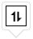

# Sorting in ##Platform_Name## Treegrid control

Sorting enables you to sort data in the `Ascending` or `Descending` order.
To sort a column, click the column header.

To sort multiple columns, press and hold the CTRL key and click the column header.  You can clear sorting of any one of the multi-sorted columns by pressing and holding the SHIFT key and clicking the specific column header.

To enable sorting in the TreeGrid, set the [`allowSorting`](../api/treegrid/#allowsorting) to true. Sorting options can be configured through the [`sortSettings`](../api/treegrid/sortSettings).

To sort, inject the [`Sort`](../api/treegrid/#sortmodule) module in the treegrid.



 







        
















> * TreeGrid columns are sorted in the `Ascending` order. If you click the already sorted column, the sort direction toggles.
> * You can apply and clear sorting by invoking [`sortByColumn`](../api/treegrid#sortbycolumn) and [`clearSorting`](../api/treegrid/#clearsorting) methods.
> * To disable sorting for a particular column, set the [`columns.allowSorting`](../api/treegrid/column/#allowSorting) to false.

## Initial sort

To sort at initial rendering, set the [`field`](../api/treegrid/sortDescriptorModel/#field) and [`direction`](../api/treegrid/sortDescriptorModel/#direction) in the `sortSettings.columns`.



 







        
















## Sorting events

During the sort action, the treegrid component triggers two events. The [`actionBegin`](../api/treegrid/#actionbegin) event triggers before the sort action starts, and the [`actionComplete`](../api/treegrid/#actioncomplete) event triggers after the sort action is completed. Using these events you can perform the needed actions.



 







        
















> The `args.requestType` is the current action name. For example, in sorting the `args.requestType` value is 'sorting'.

<!--  Custom sort comparer

You can customize the default sort action for a column by defining the [`column.sortComparer`](../api/treegrid/column/#sortcomparer) property. The sort comparer function has the same functionality like [`Array.sort`](https://developer.mozilla.org/en-US/docs/Web/JavaScript/Reference/Global_Objects/Array/sort) sort comparer.

In the following example, custom sort comparer function was defined in the `Category` column.



 







        
















> The sort comparer function will work only for the local data. -->

## Touch interaction

When you tap the treegrid header on touchscreen devices, the selected column header is sorted. A popup  is displayed for multi-column sorting. To sort multiple columns, tap the popup, and then tap the desired treegrid headers.

The following screenshot shows treegrid touch sorting.

> You can refer to our [`JavaScript Tree Grid`](https://www.syncfusion.com/javascript-ui-controls/js-tree-grid) feature tour page for its groundbreaking feature representations. You can also explore our JavaScript Tree Grid example [`JavaScript Tree Grid example`](https://ej2.syncfusion.com/demos/#/material/tree-grid/treegrid-overview.html) to knows how to present and manipulate data.
